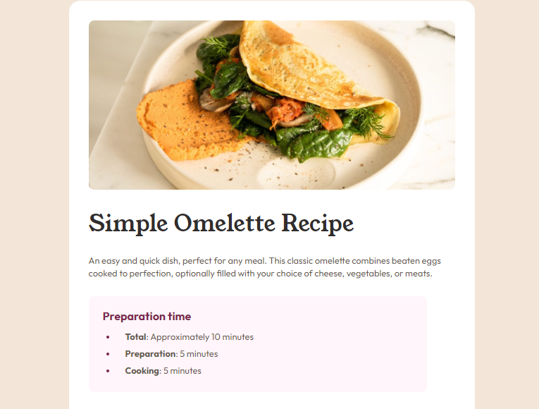
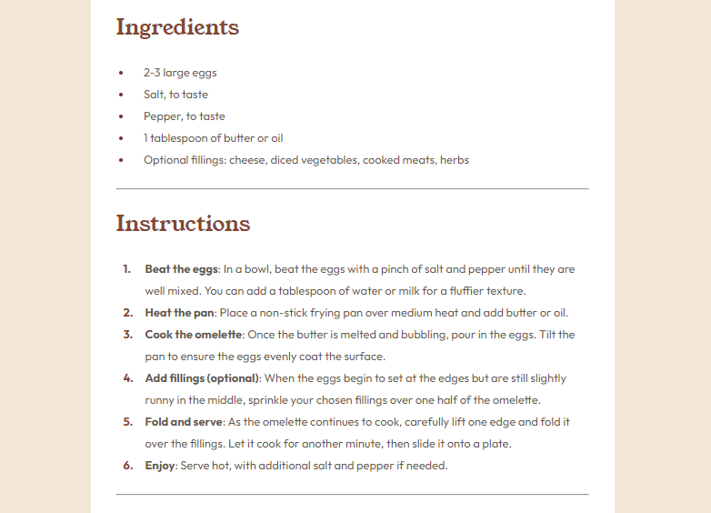
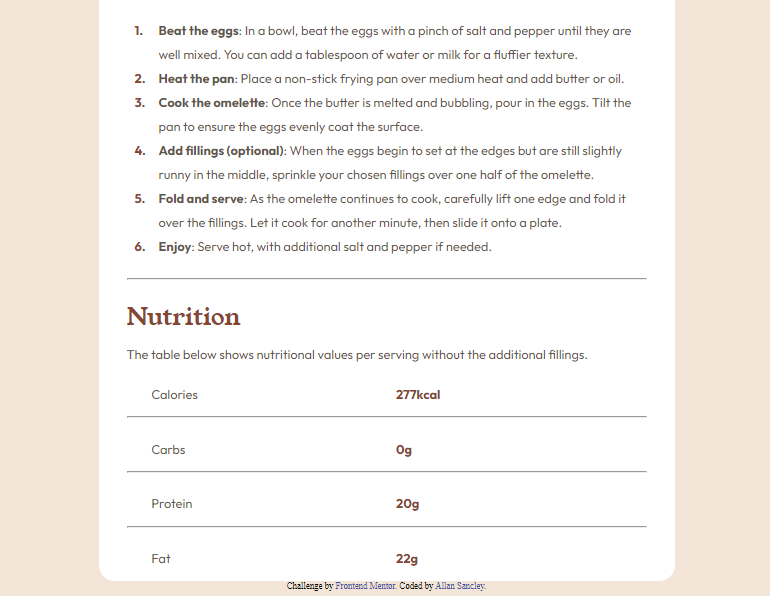

# Frontend Mentor - Recipe page solution

This is a solution to the [Recipe page challenge on Frontend Mentor](https://www.frontendmentor.io/challenges/recipe-page-KiTsR8QQKm).

## Table of contents

- [Overview](#overview)
  - [Screenshot](#screenshot)
  - [Links](#links)
- [My process](#my-process)
  - [Built with](#built-with)
  - [What I learned](#what-i-learned)
  - [Continued development](#continued-development)
- [Author](#author)
- [Acknowledgments](#acknowledgments)

## Overview

This challenge involved creating a recipe website project, and below are some of the items that were covered in this project.

### Screenshot





### Links

- [Solution ](https://github.com/AllanSancley/recipe-page-main_Fonten.mentord.git)
- [Live Site](https://recipe-page-main-frontendmentor.netlify.app/)

## My process

This challenge was important for my learning as I had difficulties at some points and I must have studied a little more in depth on the appropriate topics.

### Built with

- Semantic HTML5 markup
- CSS custom properties
- Flexbox

### What I learned

The main point where I had difficulties in this challenge was the stylization of the "li" in the instructions topic and the creation of the small table in the nutrition topic.

Here is a snippet of the code below:

style "li" from the topic instructions.

```css
.instructions ol li {
    list-style: none;
    counter-increment: number;
    position: relative;
}
.instructions ol li::before {
    content: counter(number)".";
    color:hsl(14, 45%, 36%);
    margin: 0 20px 0 -30px;
    position: absolute;
    font-weight: bold;
}
```

Nutrition topic HTML.

```html
<p class="itens-1">Calories</p>
<p class="itens-2">277kcal</p>
<hr>
<p class="itens-1">Carbs</p>
<p class="itens-2">0g</p>
<hr>
<p class="itens-1">Protein</p>
<p class="itens-2">20g</p>
<hr>
<p class="itens-1">Fat</p>
<p class="itens-2">22g</p>
```
Nutrition topic table style.

```css
.nutrition p {
    line-height: 1px;
    padding-bottom: 3px;
}
.itens-1 {
    font-family: "Outfit";
    display: inline-block;
    width: 30px;
    margin: 30px 0 0 31px;
    color: hsl(30, 10%, 34%);
}
.itens-2 {
    font-family: "Outfit";
    display: inline-block;
    margin-top: 30px;
    padding-left: 272px;
    color: hsl(14, 45%, 36%);
    font-weight: 700;
}
```

### Continued development

The challenge made me see some weak points. I must dedicate myself more to improving my code, so that I don't have so much difficulty in the future.

## Author

- Frontend Mentor - [@AllanSancley](https://www.frontendmentor.io/profile/AllanSancley)
- Github - [@AllanSancley](https://github.com/AllanSancley)
- Linkedin - [Allan Sancley](www.linkedin.com/in/allan-sancley-12b583193)

## Acknowledgments

This [topic](https://temasblog.com.br/como-mudar-os-elementos-ul-li/) made me overcome this challenge, which talks about the stylization of the "li" elements of the "UL" lists and "OL". I recommend reading it for anyone just starting out to improve their knowledge of CSS.
